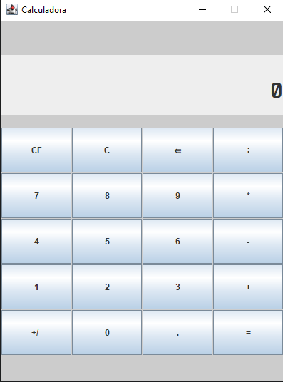

<h1 align="center"> Calculadora Java </h1>

Calculadora feita usando Java e Swing.

  <a href="#-tecnologias">Tecnologias</a>&nbsp;&nbsp;&nbsp;|&nbsp;&nbsp;&nbsp;
  <a href="#-projeto">Projeto</a>&nbsp;&nbsp;&nbsp;

 

  

## 🚀 Tecnologias

Esse projeto foi desenvolvido com as seguintes tecnologias:

- Java
- AWT e Swing

## 💻 Projeto

Calculadora feita com interface gráfica para utilização.
Embora não esteja completa, está totalmente funcional e pode ser usada para contas com os operadores aritméticos básicos.
